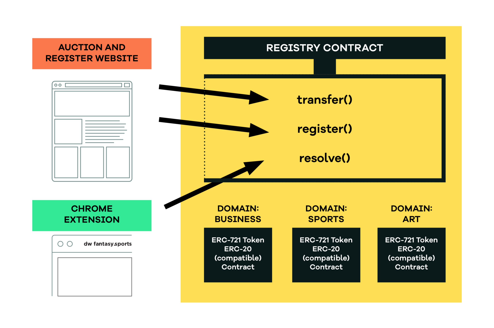

# Architecture

The Butterfly Protocol uses Ethereum contracts and tokens to track web name ownership. The term "domain" is used to represent a single name in the system. Each domain except the root domain has a parent, and the domain hierarchy forms a name or path to retrieve that domain's resources. This is analogous to domains and subdomains in a traditional DNS system, except subdomains can continue to be created under other subdomains indefinitely. For example for a web name of players. nfl.fantasy.sports, ”players" is a subdomain of "nfl", which is, in turn, a subdomain of the domain “fantasy”, which is in turn a child of the top level domain “sports”.

Each domain is represented by a non-fungible token in a standard ERC-721 contract called “RegistryToken”. There is only ever one ERC-721 token on the public Ethereum blockchain for a specific domain. The Registry contract owns the RegistryToken contract and uses it to keep track of who the owner of a domain is. The Registry contract that contains all of the other domain information \(aside from who the owner is\), and it maintains the hierarchy between domains. The Registry contract creates an instance of the RegistrarToken contract for a domain \(note that this is different from the RegistryToken contract\). The RegistrarToken contract manages the ERC-20 compatible tokens for a domain; those tokens can be used to buy subdomains of the domain they are associated with.

