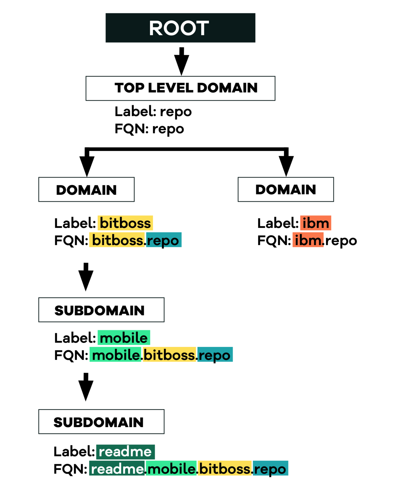

# Naming Conventions

The following diagram illustrates the naming conventions used in this paper. The system starts with a nameless Root Domain. A top-level domain \(TLD\) is the beginning of a fully qualified name \(FQN\) in Butterfly. All TLDs are subdomains of the Root Domain, which is an invisible entity in the system. Domains can be created under the TLD, and each domain can have unlimited subdomains, which in turn can have subdomains of their own and so on. The FQN is defined as the combinations of domain labels, with the TLD label being the furthest to the right; “repo” is the TLD in the FQN “mobile.bitboss.repo”.

