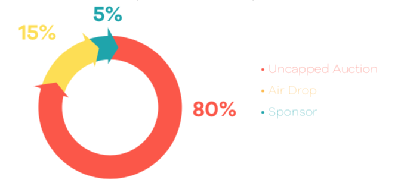
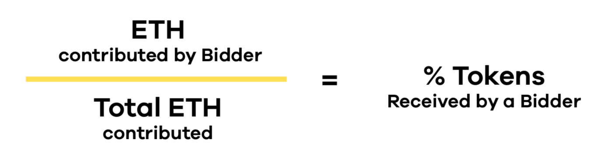
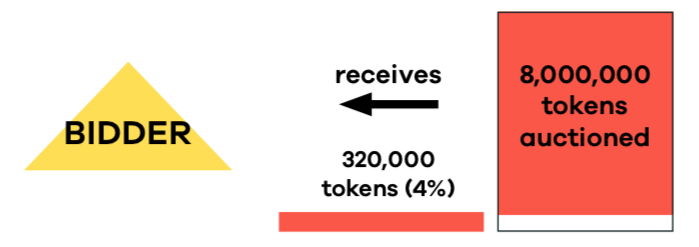
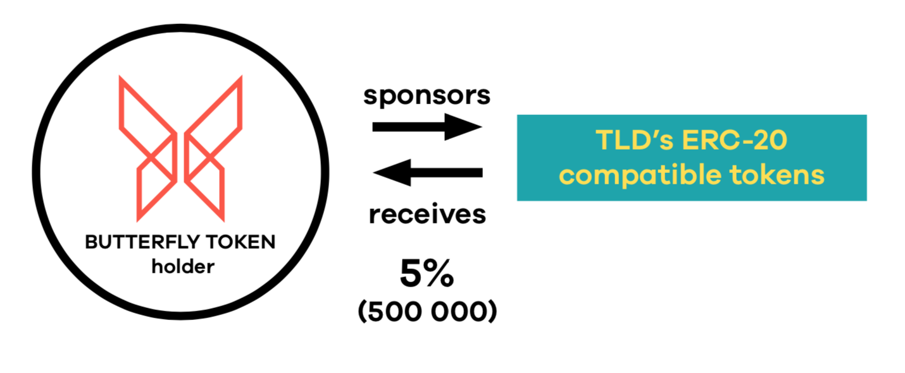
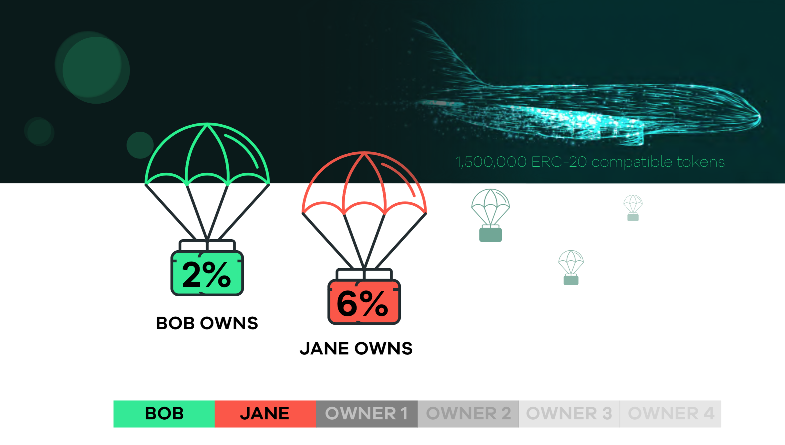
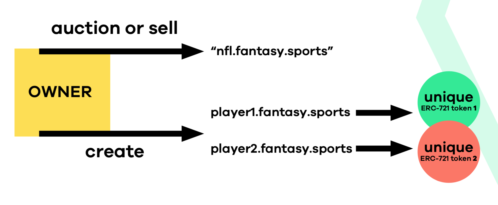

# Sponsorship

A BUTTERFLY TOKEN holder can spend their tokens to sponsor the creation of new TLDs. They can choose any available name that they want, or refer to the most popular TLD names that others would like to see created. When a new TLD name is sponsored, the TLD gets automatically created and a 10 day auction starts for the sale of its associated ERC-20 compatible tokens. 

The initial cost to sponsor a TLD is 10,000 BUTTERFLY TOKENS. This cost goes down by 10 tokens every day, starting from the day that the Butterfly DAO is launched. These cost reductions are done to ensure that it costs more to sponsor high value TLD names, which will be the ones created early on. Also this approach ensures that the system continues to generate interest with medium to lower value TLD name as time goes by. The sponsorship functionality provides ways for the BUTTERFLY TOKEN holders to have a stake in the governance of the registrar.

Let's assume that “.sports” is the TLD that has the most potential and someone therefore decides to sponsor its creation. That token holder spends the required amount of BUTTERFLY TOKENS by sending them to the Governance contract. Those tokens are burned at that point, meaning they can never be used again by anyone \(thereby raising the value of the remaining tokens in circulation\).

The Governance contract controls the process of auctioning off a subset of the ERC-20 compatible tokens for the “.sports” TLD, and it will start an uncapped auction. Bidders spend ETH and are rewarded based on the ETH that they contributed as a percentage of the total ETH contributed. By way of example, the Governance contract will create a supply of 10,000,000 ERC-20 compatible tokens for “.sports”. It will allocate:

Over the course of the 10 days, bidders send ETH to the Auction smart contract. At the end of the 10 days, each bidder’s contributed amount is divided by the total ETH collected. In this case, assume our bidder contributed 20 ETH out of a total of 500 ETH contributed by all bidders. Our bidder would now receive 4% of the ERC-20 compatible tokens that were auctioned \(20/500 = 4%\). The formula for this is:

In this example, the bidder receives 320,000 tokens, which is 4% of the 8,000,000 tokens auctioned.

The BUTTERFLY TOKEN holder that sponsored the TLD name creation receives 5% of the TLD’s ERC-20 compatible tokens, which would be 500,000.

1,500,000 ERC-20 compatible tokens \(15%\) are air dropped proportionally to all owners of the BUTTERFLY TOKEN. By way of explanation, Bob owns 2% of the total BUTTERFLY TOKENS in circulation, and Jane owns 6%. Bob therefore receives 30,000 of the “.sports” ERC-20 compatible tokens and Jane receives 90,000.

After the auction closes the new owners of the ERC-20 compatible tokens will now be able to acquire subdomains by burning a predetermined number of those ERC-20 compatible tokens for each subdomain. The first person to register a subdomain acquires it. The smart contract will specify a higher burn amount in the first week to prevent people from “domain parking” high value subdomains. This amount will reduce day by day to encourage the creation of lesser value subdomains. By example, a token owner must burn 1000 tokens to register “fantasy” under the “sports” TLD. The “fantasy” subdomain is now irrevocably associated with a specific non-fungible ERC-721 token that is owned by the person who registered it. People using Butterfly will land at the owner’s website and other resources when navigating to “fantasy.sports”.

The owner can now create their own supply of ERC-20 compatible tokens associated with the “.fantasy” subdomain. The owner can then start their own economy around the “fantasy.sports” name. They could simply point the TLD to an IP address or they could creatively use the ERC-20 compatible tokens.

Since these ERC-20 compatible tokens are fungible utility tokens they can have many potential use cases for the owner’s economy. For example the owner can auction or sell subdomains such as “nfl.fantasy.sports”. Or they could create subdomains player1.fantasy.sports and player2.fantasy. sports, where each player is represented by a unique ERC-721 token with its own supply of ERC-20 compatible tokens. Very creative new business models for fantasy sports can therefore be created.

